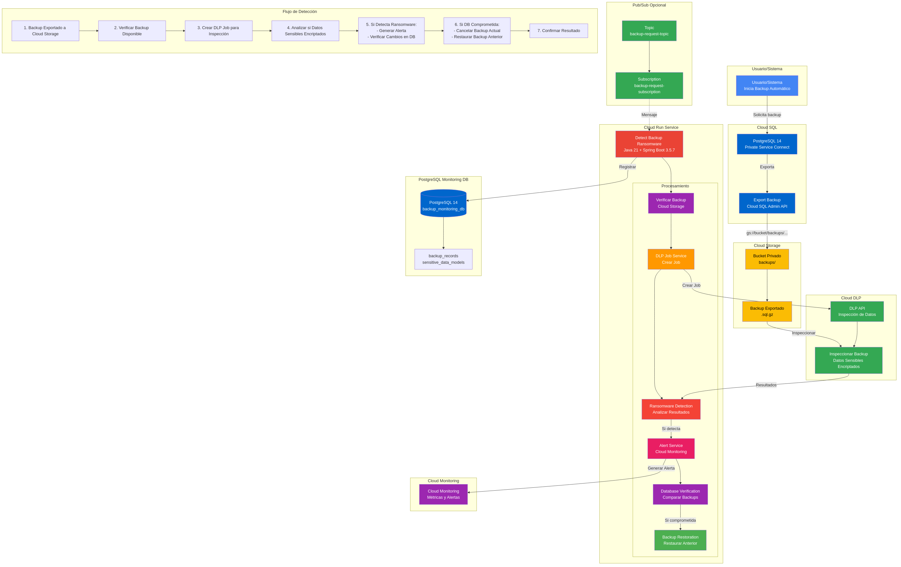

# Detect Backup Ransomware Service

Servicio Cloud Run para detectar ransomware en backups exportados desde Cloud SQL (PostgreSQL) a Cloud Storage usando Cloud DLP.

## 📋 Descripción

Este servicio monitorea backups exportados desde Cloud SQL (PostgreSQL configurado con Private Service Connect) a Cloud Storage privado. Utiliza Cloud DLP (Data Loss Prevention) para inspeccionar si los datos sensibles (emails, datos bancarios, etc.) están encriptados, lo cual podría indicar un ataque de ransomware.

## 🏗️ Arquitectura

### Diagrama de Arquitectura



El diagrama muestra el flujo completo del sistema:

1. **Cloud SQL** exporta backup a **Cloud Storage** privado
2. **Cloud Run Service** verifica el backup y crea un **DLP Job**
3. **Cloud DLP** inspecciona si los datos sensibles están encriptados
4. Si detecta ransomware:
   - Genera alerta mediante **Cloud Monitoring**
   - Verifica cambios en la base de datos
   - Si está comprometida, restaura backup anterior

Para más detalles sobre la arquitectura, ver [diagrams/README.md](diagrams/README.md).

### Diagrama de Secuencia

El siguiente diagrama de secuencia muestra el flujo detallado de interacciones entre los componentes:

```plantuml
@startuml
!theme plain
skinparam backgroundColor #FFFFFF
skinparam sequenceArrowThickness 2
skinparam roundcorner 20
skinparam maxmessagesize 60

title Diagrama de Secuencia - Detección de Ransomware en Backups

actor Usuario as User
participant "Cloud SQL\nPostgreSQL" as CloudSQL
participant "Cloud Storage\n(Privado)" as CloudStorage
participant "Cloud DLP\nAPI" as CloudDLP
participant "Detect Backup\nRansomware Service\n(Cloud Run)" as Service
participant "Cloud Monitoring" as Monitoring
participant "Alert System\n(Sistema de Alertas)" as Alerts
database "PostgreSQL\nMonitoring DB" as MonDB

== Inicio del Proceso ==

User -> CloudSQL: Iniciar backup automático
activate CloudSQL

CloudSQL -> CloudStorage: Exportar datos a Cloud Storage
activate CloudStorage
CloudStorage --> CloudSQL: Backup exportado exitosamente
deactivate CloudStorage

== Verificación y Detección ==

CloudSQL -> Service: Backup disponible en Cloud Storage
activate Service

Service -> CloudStorage: Verificar backup disponible
activate CloudStorage
CloudStorage --> Service: Backup confirmado (gs://bucket/path)
deactivate CloudStorage

Service -> MonDB: Registrar backup en BD de monitoreo
activate MonDB
MonDB --> Service: Backup registrado
deactivate MonDB

Service -> CloudDLP: Crear DLP Job para inspección
activate CloudDLP
CloudDLP --> Service: Job creado (job-id)
note right: Inspecciona si datos sensibles\nestán encriptados

Service -> CloudStorage: Enviar datos exportados para inspección
activate CloudStorage
CloudStorage -> CloudDLP: Datos para inspección
deactivate CloudStorage

CloudDLP -> CloudDLP: Inspeccionar datos en busca\nde patrones sospechosos
note right: Detecta encriptación de:\n- Emails\n- Datos bancarios\n- Tarjetas de crédito

alt [Detecta encriptación o cambios sospechosos]

    CloudDLP --> Service: Ransomware detectado\n(Findings encontrados)
    
    == Sistema de Alertas ==
    
    Service -> Alerts: Generar alerta sobre posible ataque\n(ransomware)
    activate Alerts
    
    Alerts -> Monitoring: Notificar sobre posible manipulación\nde datos
    activate Monitoring
    
    Monitoring -> CloudSQL: Revisar logs de actividad\nen la base de datos
    activate CloudSQL
    
    CloudSQL -> CloudSQL: Verificar cambios en la base de datos
    
    alt [Detecta cambios inesperados]
    
        CloudSQL --> Monitoring: Confirmar que la base de datos\nestá comprometida
        deactivate CloudSQL
        
        Monitoring --> Alerts: Confirmar que la base de datos\nestá comprometida
        
        Alerts -> Service: Base de datos comprometida\nconfirmada
        deactivate Alerts
        deactivate Monitoring
        
        == Restauración ==
        
        Service -> CloudStorage: Cancelar el backup
        activate CloudStorage
        CloudStorage --> Service: Backup cancelado
        deactivate CloudStorage
        
        Service -> CloudStorage: Restaurar backup anterior
        activate CloudStorage
        CloudStorage -> CloudSQL: Restaurar backup anterior\n(no completar backup actual)
        deactivate CloudStorage
        activate CloudSQL
        CloudSQL --> Service: Backup anterior restaurado
        deactivate CloudSQL
        
        Service -> MonDB: Registrar restauración
        activate MonDB
        MonDB --> Service: Restauración registrada
        deactivate MonDB
        
    else [No se detectan cambios]
    
        CloudSQL --> Monitoring: Confirmar que los datos\nno están comprometidos
        deactivate CloudSQL
        
        Monitoring --> Alerts: Confirmar que los datos\nno están comprometidos
        deactivate Monitoring
        deactivate Alerts
        
        Service -> MonDB: Registrar detección sin compromiso
        activate MonDB
        MonDB --> Service: Registro completado
        deactivate MonDB
        
    end

else [No se detecta ransomware]

    CloudDLP --> Service: Backup sin indicadores\nde ransomware
    deactivate CloudDLP
    
    Service -> MonDB: Registrar backup exitoso
    activate MonDB
    MonDB --> Service: Backup registrado como seguro
    deactivate MonDB

end

== Finalización ==

Service --> User: Backup completado\nResultado: [Ransomware detectado: Sí/No]\n[Database comprometida: Sí/No]\n[Backup restaurado: Sí/No]
deactivate Service

@enduml
```



**Visualización del diagrama PlantUML:**
- Puedes visualizar este diagrama usando [PlantUML Online](http://www.plantuml.com/plantuml/uml/) copiando el contenido de [`diagrams/sequence.puml`](diagrams/sequence.puml)
- O instala PlantUML localmente y genera imágenes desde el archivo `.puml`

### Flujo del Sistema

1. **Cloud SQL Export**: Cloud SQL exporta automáticamente un backup a Cloud Storage (mediante Cloud SQL Admin API)
2. **Verificación del Backup**: El servicio verifica que el backup esté disponible en Cloud Storage
3. **Inspección con Cloud DLP**: Se crea un DLP Job para inspeccionar si los datos sensibles están encriptados
4. **Detección de Ransomware**: Si se detecta encriptación sospechosa:
   - Se genera una alerta mediante Cloud Monitoring
   - Se verifica si hay cambios inesperados en la base de datos
   - Si la base de datos está comprometida:
     - Se cancela el backup actual
     - Se restaura el backup anterior más reciente que no esté comprometido
5. **Confirmación**: Se confirma al usuario el resultado del proceso

## 🚀 Características

- ✅ **Detección de Ransomware**: Usa Cloud DLP para detectar si datos sensibles están encriptados
- ✅ **Modelo de Datos Sensibles**: Configuración flexible de qué datos sensibles inspeccionar (emails, datos bancarios, etc.)
- ✅ **Cloud Storage Privado**: Trabaja con backups en Cloud Storage privado
- ✅ **Cloud SQL PostgreSQL**: Soporte para Cloud SQL PostgreSQL 14 con Private Service Connect
- ✅ **Restauración Automática**: Restaura backups anteriores cuando se detecta compromiso
- ✅ **Alertas**: Integración con Cloud Monitoring para alertas
- ✅ **Liquibase**: Migraciones de base de datos con Liquibase (YAML)
- ✅ **Docker Compose**: Entorno de desarrollo local con PostgreSQL 14 y Liquibase
- ✅ **Test Coverage**: 80% de cobertura con JUnit 5

## 📋 Requisitos

- **Java**: JDK 21
- **Spring Boot**: 3.5.7
- **PostgreSQL**: 14
- **Gradle**: 8.9+
- **GCP**:
  - Cloud SQL (PostgreSQL) con Private Service Connect
  - Cloud Storage (bucket privado)
  - Cloud DLP API (habilitada)
  - Cloud Monitoring
  - Pub/Sub (opcional, para mensajes de backup)

## ⚙️ Configuración

### Variables de Entorno

```bash
# Database
DB_HOST=localhost
DB_PORT=5432
DB_NAME=backup_monitoring_db
DB_USERNAME=postgres
DB_PASSWORD=postgres123

# GCP
GOOGLE_CLOUD_PROJECT=your-project-id
CLOUD_SQL_INSTANCE_ID=your-instance-id
GCS_BACKUP_BUCKET=your-backup-bucket
GCS_BACKUP_PREFIX=backups/

# Cloud DLP
DLP_ENABLED=true

# Alertas
ALERTS_ENABLED=true

# Pub/Sub
PUBSUB_ENABLED=true
PUBSUB_SUBSCRIPTION=backup-request-subscription
```

### Configuración de Cloud DLP

El servicio requiere que Cloud DLP API esté habilitada en tu proyecto GCP:

```bash
gcloud services enable dlp.googleapis.com
```

### Modelo de Datos Sensibles

El servicio usa una tabla `sensitive_data_models` para configurar qué datos sensibles inspeccionar. Por defecto, incluye:

- **EMAIL**: Emails de usuarios (`users.email`)
- **PHONE**: Teléfonos de usuarios (`users.phone`)
- **CREDIT_CARD**: Números de tarjetas (`bank_accounts.credit_card_number`)
- **BANK_ACCOUNT**: Números de cuenta bancaria (`bank_accounts.account_number`)
- **FINANCIAL_DATA**: Números de routing (`bank_accounts.routing_number`)

Puedes agregar más modelos de datos sensibles insertando registros en la tabla `sensitive_data_models`.

## 🏃 Ejecución Local

### Con Docker Compose

```bash
# Iniciar servicios (PostgreSQL 14 + Liquibase + App)
docker-compose up -d

# Ver logs
docker-compose logs -f app

# Detener servicios
docker-compose down
```

Liquibase aplicará automáticamente las migraciones al iniciar PostgreSQL.

### Sin Docker

```bash
# Compilar
./gradlew build

# Ejecutar (requiere PostgreSQL en ejecución)
./gradlew bootRun
```

## 📊 Base de Datos

### Estructura

- **backup_records**: Registra todos los backups y resultados de detección
- **sensitive_data_models**: Configuración de datos sensibles a inspeccionar
- **users**: Datos de usuarios (ejemplo)
- **bank_accounts**: Datos bancarios (ejemplo)

### Migraciones

Las migraciones de Liquibase están en formato YAML en:
- `src/main/resources/db/changelog/db.changelog-master.yaml`
- `src/main/resources/db/changelog/changes/*.yaml`

## 🔍 Uso del Servicio

### Procesar un Backup Exportado

El servicio espera que Cloud SQL ya haya exportado el backup a Cloud Storage. Luego, puedes enviar un mensaje a Pub/Sub o llamar directamente al servicio:

```json
{
  "databaseInstance": "my-instance",
  "databaseName": "my-database",
  "backupBucket": "my-backup-bucket",
  "backupPrefix": "backups/",
  "backupLocation": "gs://my-backup-bucket/backups/2024/11/15/my-database_20241115_120000.sql.gz",
  "requestedAt": "2024-11-15T12:00:00",
  "requestedBy": "cloud-scheduler"
}
```

### Formato de Ubicación del Backup

Cloud SQL exporta backups con un formato específico. El servicio puede:
1. Usar la ubicación proporcionada en `backupLocation`
2. Construir la ubicación esperada basándose en el patrón: `gs://bucket/backups/YYYY/MM/DD/database_timestamp.sql.gz`
3. Buscar automáticamente el backup más reciente de la base de datos

## 🧪 Testing

```bash
# Ejecutar tests
./gradlew test

# Verificar cobertura (debe ser >= 80%)
./gradlew jacocoTestReport
open build/jacocoHtml/index.html
```

## 🐳 Docker

### Construir Imagen

```bash
docker build -t detect-backup-ransomware:latest .
```

### Ejecutar Contenedor

```bash
docker run -p 8080:8080 \
  -e GOOGLE_CLOUD_PROJECT=your-project \
  -e DB_HOST=your-db-host \
  -e DB_PASSWORD=your-password \
  detect-backup-ransomware:latest
```

## ☁️ Despliegue en Cloud Run

```bash
# Construir y desplegar
gcloud run deploy detect-backup-ransomware \
  --source . \
  --platform managed \
  --region us-central1 \
  --allow-unauthenticated \
  --set-env-vars GOOGLE_CLOUD_PROJECT=your-project \
  --set-env-vars DLP_ENABLED=true
```

## 📝 API Endpoints

### Health Check
```
GET /actuator/health
```

### Metrics
```
GET /actuator/metrics
```

## 🔒 Seguridad

- ✅ Usa imagen Distroless para runtime
- ✅ Usuario no-root en contenedor
- ✅ No loguea información sensible
- ✅ Cloud Storage privado
- ✅ Private Service Connect para Cloud SQL
- ✅ Validación de inputs

## 📚 Arquitectura

El servicio sigue el diagrama de secuencia UML proporcionado:

1. **Usuario** inicia backup automático → **Cloud SQL**
2. **Cloud SQL** exporta datos → **Cloud Storage**
3. **Cloud Storage** → **Cloud DLP** (inspección)
4. Si detecta ransomware:
   - **Cloud DLP** → **Sistema de Alertas** → **Cloud Monitoring**
   - **Cloud Monitoring** → **Cloud SQL** (verificar cambios)
   - Si detecta cambios inesperados:
     - **Cloud SQL** → **Cloud Storage** (cancelar backup)
     - **Cloud Storage** → **Cloud SQL** (restaurar backup anterior)
5. **Cloud SQL** → **Usuario** (confirmar resultado)

## 🐛 Troubleshooting

### Cloud DLP no está habilitado

Si ves el mensaje "Cloud DLP no está habilitado", habilita la API:

```bash
gcloud services enable dlp.googleapis.com --project=your-project-id
```

### Backup no encontrado

Verifica que:
- El backup existe en Cloud Storage
- La ubicación del backup es correcta (`gs://bucket/path`)
- El servicio tiene permisos para acceder a Cloud Storage

### Error de conexión a PostgreSQL

Verifica:
- PostgreSQL está ejecutándose (docker-compose up postgres)
- Las credenciales son correctas
- El puerto 5433 está disponible (local) o usa Private Service Connect (producción)

## 📄 Licencia

Este proyecto es de uso interno.

## 🤝 Contribuir

1. Fork el proyecto
2. Crea una rama para tu feature (`git checkout -b feature/AmazingFeature`)
3. Commit tus cambios (`git commit -m 'Add some AmazingFeature'`)
4. Push a la rama (`git push origin feature/AmazingFeature`)
5. Abre un Pull Request

